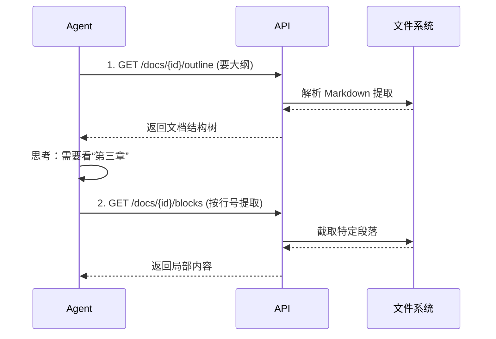
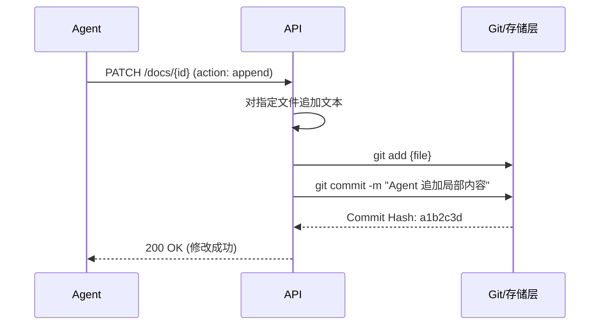
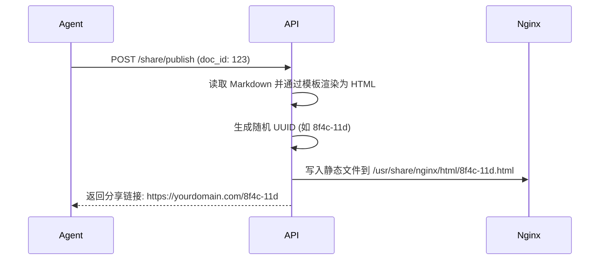

# AI 驱动文档管理系统 - 项目规划与架构设计

## 1. 项目定位与核心目标

这是一个**以 AI Agent 为核心驱动**的轻量级个人 Markdown 知识库系统。与传统的笔记软件不同，本系统将 AI Agent 视为一等公民（Primary User），API 接口专为 Agent 的“阅读习惯”和“安全控制”量身定制。

**核心特点：**
- **无前端管理面板**：抛弃繁重的 Web 后台，完全由接口驱动。日常操作由 Agent 代劳。
- **Agent 友好型 I/O**：支持按块读取、获取大纲、增量修改（打补丁），节省 Token 消耗，防止并发覆盖。
- **极致的安全兜底**：底层基于 Git 版本控制，不支持物理删除，防止 Agent “发疯”导致数据丢失。
- **公网沙箱发布**：支持将特定的笔记渲染为静态网页，通过 Nginx 挂载到公网分享。

---

## 2. 系统架构设计

整个系统分为四个主要模块，各司其职，保证了内部的绝对安全和外部的隔离。

```mermaid
graph TD
    subgraph 内部安全区 (内网环境)
        Agent[AI Agent 客户端\n发出指令与思考] 
        
        API[API Server 中枢\nFastAPI / Gin]
        
        Storage[(本地文件系统\nMarkdown + Git仓库)]
    end
    
    subgraph 公网访问区 (DMZ/公网)
        Nginx[Nginx 静态服务器]
        User((外部用户))
    end

    Agent <-->|REST API| API
    API <-->|读写/Git Commit| Storage
    API -->|渲染HTML & 生成UUID| Nginx
    User -->|HTTP 访问 UUID 链接| Nginx
```

### 模块说明
1. **AI Agent (大脑)**：可以是任意接入了 LLM 的脚本或应用。它通过调用 API Server 来阅读、检索、整理和创作笔记。
2. **API Server (中枢)**：系统核心。负责解析 Agent 的请求，将其转化为具体的文件读写、Git 命令或搜索指令。
3. **Storage (存储)**：就是纯文本的 Markdown 文件夹，被 Git 接管。包含普通笔记以及 `.trash/` 逻辑回收站。
4. **Nginx (分发)**：API Server 将需要公开的 Markdown 转换为静态 HTML，放入 Nginx 指定的只读目录，供外网访问。

---

## 3. 核心数据流转 (Data Flow)

### 场景一：Agent 高效阅读与整理
为了避免上下文溢出，Agent 采取“先看目录，再看局部”的策略。


### 场景二：安全的增量修改机制
Agent 对文档进行修改时，通过 PATCH 和 Git 保证数据安全。

*注：如果 Agent 修改出错，可以通过 `POST /rollback` 传入 Commit Hash 一键回退。*

### 场景三：公网笔记发布
将内网的私密笔记安全地暴露给外部。


---

## 4. 技术栈选型建议

鉴于您目前是个人使用且需求轻量化，建议采用以下极简技术栈：

- **服务端语言/框架**：**Python + FastAPI**
  - *理由*：Python 拥有丰富的 Markdown 处理库（如 `markdown`、`mistune`），对 AI/Agent 生态极其友好。FastAPI 性能高且自动生成 API 文档，方便您调试。
- **版本控制与操作**：**GitPython** (Python库)
  - *理由*：直接在代码里调用 Git 命令（Commit, Log, Checkout 等），完美实现您的“安全兜底”设计。
- **检索引擎**：**Whoosh** 或直接基于命令行的 **grep/ripgrep**
  - *理由*：由于去掉了 RAG，无需引入复杂的 ChromaDB。普通的关键字倒排搜索用 Python 原生库或系统命令即可极速完成。
- **公网分发**：**Nginx**
  - *理由*：极其轻量、安全的静态资源服务器。

---

## 5. 项目落地路线图 (Roadmap)

- **Phase 1: 核心地基构建**
  - 搭建 FastAPI 项目。
  - 实现 Markdown 文件的基本读写（`/docs` 的 GET、PUT）。
  - 跑通底层 Git 自动提交流程，实现 `/history` 和 `/rollback` 接口。
- **Phase 2: Agent 进阶能力**
  - 实现 `/outline` 解析功能。
  - 实现 `/blocks` 和 `/meta` (PATCH) 局部与元数据修改能力。
  - 接入关键字精准检索功能。
- **Phase 3: 公网分享功能**
  - 编写 Markdown 转 HTML 的渲染脚本。
  - 实现 `/share/publish` 和 `/share/{uuid}` 接口。
  - 配置 Nginx 环境。
